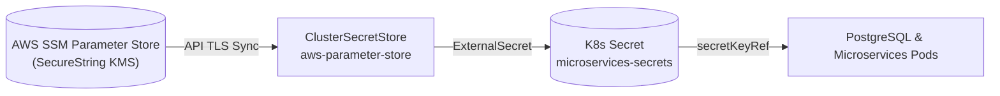

# Enterprise Bare-Metal Kubernetes Platform (RKE2 + GitOps)

An enterprise-grade, high-availability bare-metal Kubernetes platform running on RKE2, orchestrated via GitOps (ArgoCD), backed by a **3-Node Synology Enterprise NAS**, secured by **AWS SSM Parameter Store & External Secrets Operator**, and observed via **Loki, Promtail, Prometheus, and Grafana**.

---

## 1. Cluster Architecture & Topology

```
VIP: 10.0.2.60 (Keepalived Floating VIP / Control-Plane Endpoint)
├── Master 1 (10.0.2.50)
├── Master 2 (10.0.2.51)
└── Master 3 (10.0.2.52)

Workers:
├── Worker 1 (10.0.2.53)
├── Worker 2 (10.0.2.54)
└── Worker 3 (10.0.2.55)

MetalLB Ingress VIP: 10.0.2.56 (*.internal.local)
High-Availability NAS: Synology Enterprise NAS (10.0.0.250 /volume1/k8s-lab-storage)
```

---

## 2. Secrets Management: AWS SSM as Single Source of Truth

All application credentials are kept 100% out of Git. **AWS Systems Manager (SSM) Parameter Store** is the Single Source of Truth (SSOT).



### Quick Secret Provisioning
Create or rotate the database password in AWS SSM with one command:
```bash
aws ssm put-parameter \
  --name "/production/microservices/db_password" \
  --value "YourSuperSecurePassword123!" \
  --type SecureString \
  --region ap-south-1 \
  --overwrite
```

The cluster's **External Secrets Operator (ESO)** automatically synchronizes the secret into the `microservices` namespace as `microservices-secrets`.

For full operational procedures, see the [AWS SSM & ESO Operational Guide](file:///Users/amritpoudel/k8s-rke2/k8s-deploy/11_aws_ssm_external_secrets_guide.md).

---

## 3. Asynchronous Microservices Platform

Located in [`app/`](file:///Users/amritpoudel/k8s-rke2/app/) (source code) and [`manifests/07-microservices/`](file:///Users/amritpoudel/k8s-rke2/manifests/07-microservices/) (GitOps manifests):

```
[ Ingress NGINX (10.0.2.56) ]
               │
      ┌────────┴────────┐
   Path: /           Path: /api
      │                 │
      ▼                 ▼
[ Frontend UI ]   [ Backend API ] ──► [ Redis Queue ]
(Alpine NGINX)    (FastAPI)                  │
                                        (BRPOP)
                                             │
                                             ▼
                      [ PostgreSQL 16 ] ◄── [ Async Worker ]
                      (Synology NAS)
```

- **Frontend (`app/frontend/`)**: Modern dark-mode dashboard with live queue depth, interactive task submitter, and 3-second auto-poll stream.
- **Backend API (`app/backend/`)**: FastAPI REST service with `/healthz` probes, fail-fast secret loaders, and Redis task dispatch.
- **Queue**: Redis in-memory broker.
- **Async Worker (`app/worker/`)**: Python consumer pulling tasks with `BRPOP` and updating PostgreSQL.
- **Database**: PostgreSQL 16 stateful service with PVC backed by `synology-nfs`.

---

## 4. Docker Build Optimizations & Build Speed Engineering

1. **Multi-Stage vs. Single-Stage**: Production images strip all build tools (`gcc`, `make`, headers) and run under unprivileged non-root user (`USER 10001`), dropping image sizes from ~1.2 GB to ~130 MB.
2. **Layer Caching (Anti-Meme Engineering)**: `COPY requirements.txt .` precedes `COPY . .`. Fixing comment typos rebuilds in under 2 seconds!
3. **CI Path-Filtering**: In `.github/workflows/ci.yaml`, markdown and documentation changes never trigger image builds.

---

## 5. Deployment & Rollback Lifecycle

All platform manifests in `manifests/` are continuously reconciled by **ArgoCD**.

### Rollback Options:
1. **Pure GitOps Revert**: `git revert <bad-commit-hash> && git push origin main` (Audit-compliant, zero drift).
2. **Emergency Break-Glass**: ArgoCD UI $\rightarrow$ History and Rollback $\rightarrow$ Click **Rollback** (< 10 seconds).
3. **Kubernetes Rollout Undo**: `kubectl rollout undo deployment/backend-api -n microservices`.
4. **CI Workflow Dispatch**: Manual trigger via GitHub Actions UI selecting the target tag.

---

## 6. Repository Index & Guides

- [00: Cluster Topology and Planning](file:///Users/amritpoudel/k8s-rke2/k8s-deploy/00_cluster_topology_and_plan.md)
- [06: Synology Enterprise NAS Storage](file:///Users/amritpoudel/k8s-rke2/k8s-deploy/06_synology_nas_storage.md)
- [09: Centralized Logging (Loki Stack & Promtail)](file:///Users/amritpoudel/k8s-rke2/k8s-deploy/09_centralized_logging_loki.md)
- [10: Microservices, CI/CD, & GitOps Architecture](file:///Users/amritpoudel/k8s-rke2/k8s-deploy/10_microservices_cicd_gitops_architecture.md)
- [11: AWS SSM & External Secrets Operator Guide](file:///Users/amritpoudel/k8s-rke2/k8s-deploy/11_aws_ssm_external_secrets_guide.md)
