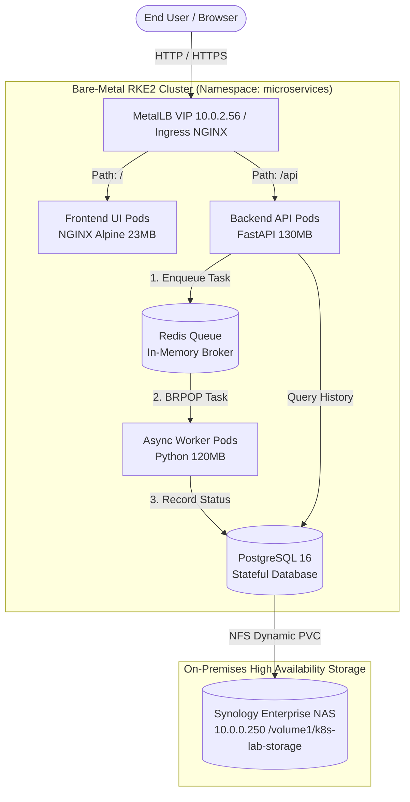
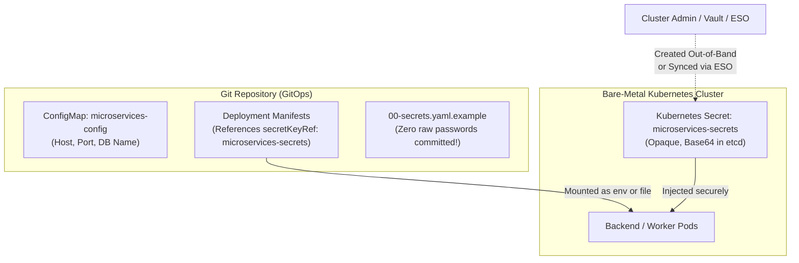
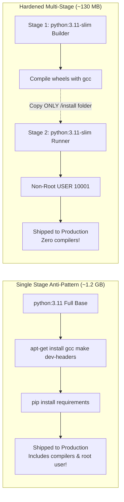
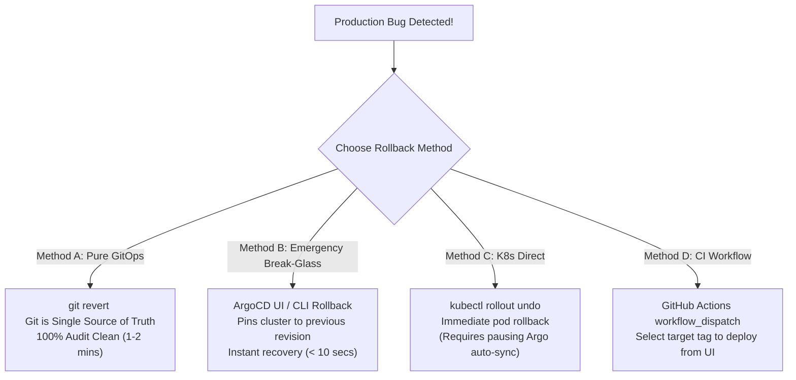

# Phase 10: 4-Microservice Platform, Multi-Stage CI/CD, and GitOps Automation

## 1. Architectural Overview

This architecture deploys a production-grade, asynchronous 4-microservice task processing platform onto our bare-metal RKE2 Kubernetes cluster. All persistent data is hosted on our on-premise **3-Node Synology Enterprise NAS** (`10.0.0.250`) via dynamic NFS volume provisioning (`synology-nfs`), with zero reliance on cloud services.



---

## 1.1 Enterprise Secrets Decoupling & Security Architecture

### Why Hardcoded Credentials & ConfigMap Passwords Are Anti-Patterns
1. **ConfigMap vs. Secret Separation**:
   - `ConfigMap` is **strictly for non-sensitive data** (hostnames, ports, log levels, flags). It is stored unencrypted and visible to anyone inspecting manifests.
   - Passwords, API tokens, and private keys MUST live in Kubernetes `Secret` resources or external vaults.
2. **Eliminating Insecure Fallbacks in Code**:
   - Source code must NEVER contain default fallback passwords (e.g. `os.getenv("DB_PASSWORD", "default123")`).
   - If an injected secret is missing, the application must **fail fast** at startup with a critical error and refuse to boot.
3. **Environment Variables vs. In-Memory Volume Mounts (`/etc/secrets/`)**:
   - In Kubernetes, Kubelet injects environment variables into the container's Linux process environment (`/proc/self/environ`).
   - However, high-security enterprise environments prefer **in-memory `tmpfs` volume mounts** (`/etc/secrets/db-password`). Environment variables can be accidentally exposed in stack traces, APM crash reporters, or child processes.
   - Our backend and worker services implement a **Dual Secret Loader** (`load_secret`):
     1. Prioritizes `/etc/secrets/db-password` (tmpfs volume mount).
     2. Falls back to `DB_PASSWORD` (injected via `secretKeyRef` from a Kubernetes Secret).
     3. If neither is present, terminates with `CRITICAL SECURITY CONFIGURATION ERROR`.

### How GitOps Handles Secrets Without Committing Passwords to Git
In GitOps, Git is the Single Source of Truth, but raw passwords must never be committed.



1. **Pattern 1: Out-of-Band Cluster Secret (Direct & Simple)**:
   The admin creates `microservices-secrets` once directly on the cluster using `kubectl`:
   ```bash
   kubectl create secret generic microservices-secrets \
     --namespace microservices \
     --from-literal=db-password="$(openssl rand -base64 24)" \
     --dry-run=client -o yaml | kubectl apply -f -
   ```
2. **Pattern 2: External Secrets Operator (ESO)**:
   The cluster already has ESO running (`manifests/05-secrets/`). An `ExternalSecret` resource pulls the password dynamically from AWS ParameterStore, HashiCorp Vault, or 1Password and automatically creates `microservices-secrets` in the cluster.
3. **Pattern 3: SealedSecrets / Mozilla SOPS**:
   The secret is encrypted with a public key and safely committed to Git; only the cluster controller can decrypt it.

---

## 2. Multi-Stage vs. Single-Stage Docker Builds

A key enterprise security and performance requirement is eliminating bloated, dangerous single-stage container builds.

### Side-by-Side Comparison

| Metric / Dimension | Single-Stage Build (`Dockerfile.single-stage`) | Multi-Stage Build (`Dockerfile`) |
| :--- | :--- | :--- |
| **Final Shipped Size** | **~1.2 GB** (Full OS, compiler toolchains, dev headers) | **~130 MB** (Lean runtime binary + virtualenv only) |
| **Attack Surface** | **Critical Risk**: Contains `gcc`, `make`, `libpq-dev`, `git`. Attackers with RCE can compile exploits in-container. | **Hardened**: Compilers completely discarded. Zero build tools in shipped image. |
| **Execution User** | `root` (`UID 0`) — dangerous container escape risk. | `appuser` (`UID 10001`) — unprivileged non-root user. |
| **Known CVEs (Trivy)** | **250+ CVEs** (OS packages, build libraries). | **< 5 CVEs** (Minimal slim runtime). |
| **Download / Pull Speed**| 45–90 seconds per node on rolling updates. | 2–4 seconds per node. |



---

## 3. Build Speed Optimization: Solving the "Typo in Comment" Rebuild Meme

> **The Meme**: *"Watching your entire 15-minute pipeline re-download the internet and recompile all wheels just because you fixed a typo in a code comment."*

### Root Cause Analysis
Docker evaluates layer cache line-by-line using checksums. If a Dockerfile is structured like this:

```dockerfile
# ❌ THE WRONG WAY (Busts cache on ANY file edit):
FROM python:3.11-slim
WORKDIR /app
COPY . .                      <-- Modifying ANY line (even a comment) changes this checksum!
RUN pip install -r requirements.txt  <-- Cache is busted! Re-runs pip install from scratch!
```

### The Solution: Layer Inversion & Path Filtering

#### 1. Dependency Manifest First
In `app/backend/Dockerfile` and `app/worker/Dockerfile`:

```dockerfile
# ⚡ THE RIGHT WAY (Optimized Layer Caching):
# Step 1: Copy ONLY dependency list
COPY requirements.txt .

# Step 2: Install dependencies (Cached unless requirements.txt changes!)
RUN pip install --no-cache-dir --prefix=/install -r requirements.txt

# Step 3: Copy application source code LAST!
COPY . .
```
- When you edit `main.py` or fix a comment typo, **Step 1 and Step 2 are 100% CACHED by Docker**.
- The build re-runs ONLY Step 3, completing in **under 2 seconds**!

#### 2. The `.dockerignore` Guardrail
Files like `*.md`, `docs/`, and `.git` are ignored. Modifying documentation never invalidates the Docker build context.

#### 3. GitHub Actions Path-Filtering
In `.github/workflows/ci.yaml`:
```yaml
paths:
  - 'app/backend/**'
  - 'app/worker/**'
  - 'app/frontend/**'
paths-ignore:
  - '**.md'
  - 'docs/**'
  - 'manifests/**'
```
Fixing typos in markdown, documentation, or Kubernetes YAML does not even trigger the CI pipeline.

#### 4. GitHub Actions Cache (`type=gha`)
With `docker/build-push-action@v5`, layer caches are persisted in the GitHub Actions runner cache across runs, preventing fresh runners from starting from scratch.

---

## 4. GitOps Cross-Repository Synchronization

In real-world enterprise infrastructure, **Application Code** and **Infrastructure Manifests** live in separate repositories:

```
┌──────────────────────────────────────┐       ┌──────────────────────────────────────┐
│  Repo 1: Application Source Code     │       │  Repo 2: GitOps Infrastructure       │
│  (e.g., k8s-microservices-app)       │       │  (AmreetPoudel/k8s)                  │
│                                      │       │                                      │
│  - app/backend/                      │       │  - manifests/00-argocd/              │
│  - app/worker/                       │       │  - manifests/01-storage/             │
│  - app/frontend/                     │       │  - manifests/07-microservices/       │
│  - .github/workflows/ci.yaml         │       │                                      │
└──────────────────┬───────────────────┘       └──────────────────▲───────────────────┘
                   │                                              │
                   ▼                                              │
         [ GitHub Actions CI ]                                    │
                   │                                              │
       (1) Build & Tag Image                                      │
       (2) Push to GHCR (sha-a1b2c3d)                             │
       (3) Clone GitOps Repo ─────────────────────────────────────┘
       (4) Update Image Tag in manifests/07-microservices/*.yaml
       (5) Commit & Push: "ci(gitops): deploy sha-a1b2c3d [skip ci]"
                                                                  │
                                                                  ▼
                                                      [ ArgoCD Engine in K8s ]
                                                                  │
                                                      (6) Detects Git commit
                                                      (7) Reconciles Bare-Metal Cluster
                                                      (8) Zero-Downtime Rolling Update
```

### How the CI Pipeline Updates the GitOps Manifests
The `gitops-sync` job in `.github/workflows/ci.yaml` executes:
```bash
# 1. Compute unique commit tag
NEW_TAG="sha-${{ github.sha }}"

# 2. Update deployment manifests using sed or yq
sed -i "s|image: ghcr.io/${{ env.REPO_OWNER }}/backend:.*|image: ghcr.io/${{ env.REPO_OWNER }}/backend:${NEW_TAG}|g" manifests/07-microservices/03-backend.yaml
sed -i "s|image: ghcr.io/${{ env.REPO_OWNER }}/worker:.*|image: ghcr.io/${{ env.REPO_OWNER }}/worker:${NEW_TAG}|g" manifests/07-microservices/04-worker.yaml

# 3. Commit and push back to the manifests repo
git commit -m "ci(gitops): deploy microservices release ${NEW_TAG} [skip ci]"
git push origin main
```

---

## 5. Architectural Rollback Options

When a faulty release reaches production, how do we roll back? Here are the 4 battle-tested strategies:



### Strategy 1: Pure GitOps Revert (Recommended Standard)
- **Execution**: Run `git revert <commit-hash> && git push origin main` in the manifests repo.
- **Why it's best**: Zero configuration drift. ArgoCD automatically detects the revert and rolls back the pods. Full git history preserves who initiated the rollback and why.

### Strategy 2: ArgoCD UI / CLI Emergency Break-Glass
- **Execution**: In ArgoCD UI, click the deployment $\rightarrow$ click **History and Rollback** $\rightarrow$ select the previous healthy release $\rightarrow$ click **Rollback**. Or via CLI:
  ```bash
  argocd app rollback root-platform-app <revision-id>
  ```
- **Why it's useful**: If production is down and customers are failing, you cannot wait for git commits or CI pipelines. This instantly restores the previous known-good deployment in < 10 seconds.
- **Follow-up required**: Once the fire is out, execute `git revert` so Git matches the cluster state before re-enabling auto-sync.

### Strategy 3: Kubernetes Native Rollback
- **Execution**:
  ```bash
  kubectl rollout undo deployment/backend-api -n microservices
  ```
- **Note**: If ArgoCD `selfHeal: true` is enabled, ArgoCD will detect cluster drift and attempt to re-apply the Git manifest! Therefore, break-glass rollouts require setting `selfHeal: false` temporarily.

### Strategy 4: GitHub Actions Workflow Dispatch Rollback
- In `.github/workflows/ci.yaml`, the `workflow_dispatch` trigger enables engineers to manually select a prior image tag from the GitHub UI dropdown, which commits the tag update directly to GitOps.

---

## 6. Separating into an Independent GitHub Repository

If you wish to host the application source code in a distinct GitHub repository (e.g. `AmreetPoudel/k8s-microservices-app`):

```bash
# 1. From the workspace root:
cd /Users/amritpoudel/k8s-rke2

# 2. Copy the app folder to a standalone directory (or initialize git directly inside app/):
mkdir -p /Users/amritpoudel/k8s-microservices-app
cp -r app/* /Users/amritpoudel/k8s-microservices-app/
cp -r app/.github /Users/amritpoudel/k8s-microservices-app/
cp app/.dockerignore /Users/amritpoudel/k8s-microservices-app/

# 3. Initialize git and push to your new GitHub repo:
cd /Users/amritpoudel/k8s-microservices-app
git init
git add .
git commit -m "feat: initial commit of enterprise task microservices application"
git branch -M main
git remote add origin git@github.com:AmreetPoudel/k8s-microservices-app.git
git push -u origin main
```
