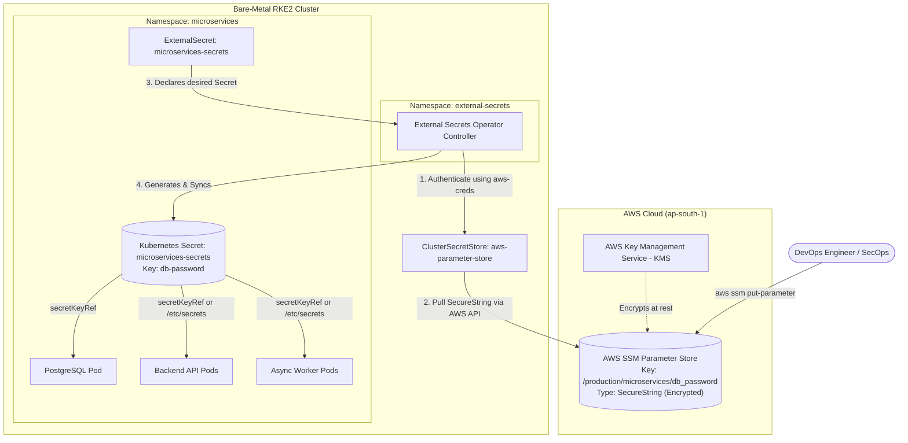

# Phase 11: Enterprise Secrets Management with AWS Systems Manager (SSM) & External Secrets Operator (ESO)

## 1. Architectural Overview: AWS SSM as the Single Source of Truth

In an enterprise DevSecOps workflow, **Git holds the architecture, but AWS holds the credentials**. Storing secrets in Git (even base64-encoded Kubernetes Secrets) is a major audit violation. 

By leveraging **AWS Systems Manager (SSM) Parameter Store** combined with the **External Secrets Operator (ESO)**, we achieve a 100% secretless GitOps workflow on our on-premise bare-metal RKE2 cluster:



---

## 2. Step 1: Create the Secret in AWS SSM Parameter Store

The secret value is created **strictly once** in AWS SSM. It never touches a local file or Git commit.

### Method A: Using AWS CLI (Recommended)

Run from your workstation or bastion with AWS access:

```bash
aws ssm put-parameter \
  --name "/production/microservices/db_password" \
  --description "PostgreSQL master password for enterprise microservices suite" \
  --value "SuperSecurePass_$(openssl rand -hex 12)!" \
  --type "SecureString" \
  --region "ap-south-1" \
  --overwrite
```

### Method B: Using AWS Management Console

1. Navigate to **AWS Systems Manager** $\rightarrow$ **Parameter Store**.
2. Click **Create parameter**.
3. Set **Name**: `/production/microservices/db_password`.
4. Set **Tier**: `Standard`.
5. Set **Type**: `SecureString` (select the default AWS KMS Key `alias/aws/ssm`).
6. Enter your password in the **Value** field.
7. Click **Create parameter**.

---

## 3. Step 2: How External Secrets Operator Binds to AWS

### A. The Cluster-Wide Connector (`ClusterSecretStore`)
Located at [`manifests/05-secrets/01-secretstore.yaml`](file:///Users/amritpoudel/k8s-rke2/manifests/05-secrets/01-secretstore.yaml):

```yaml
apiVersion: external-secrets.io/v1beta1
kind: ClusterSecretStore
metadata:
  name: aws-parameter-store
spec:
  provider:
    aws:
      service: ParameterStore
      region: ap-south-1
      auth:
        secretRef:
          accessKeyIDSecretRef:
            name: aws-creds
            namespace: default
            key: access-key-id
          secretAccessKeySecretRef:
            name: aws-creds
            namespace: default
            key: secret-access-key
          sessionTokenSecretRef:
            name: aws-creds
            namespace: default
            key: session-token
```
- Because it is a `ClusterSecretStore`, it is **cluster-scoped**. Any namespace (`default`, `microservices`, etc.) can consume it without needing separate AWS credentials.
- It authenticates to AWS using the `aws-creds` secret located in namespace `default`.

---

### B. The Application ExternalSecret
Located at [`manifests/07-microservices/00-external-secret.yaml`](file:///Users/amritpoudel/k8s-rke2/manifests/07-microservices/00-external-secret.yaml):

```yaml
apiVersion: external-secrets.io/v1beta1
kind: ExternalSecret
metadata:
  name: microservices-secrets
  namespace: microservices
spec:
  refreshInterval: 1h # Checks AWS SSM every 1 hour for automated rotation
  secretStoreRef:
    name: aws-parameter-store
    kind: ClusterSecretStore
  target:
    name: microservices-secrets
    creationPolicy: Owner
  data:
  - secretKey: db-password
    remoteRef:
      key: /production/microservices/db_password
```

**How ESO reconciles this**:
1. ESO queries AWS SSM Parameter Store for `/production/microservices/db_password`.
2. Decrypts the value using KMS.
3. Automatically creates or updates the native Kubernetes Secret `microservices-secrets` in the `microservices` namespace:
   ```yaml
   apiVersion: v1
   kind: Secret
   metadata:
     name: microservices-secrets
     namespace: microservices
   type: Opaque
   data:
     db-password: <base64-encoded-decrypted-value>
   ```

---

## 4. Step 3: Consumption by Microservices Pods

All 3 components (`postgres`, `backend`, and `worker`) automatically consume this secret:

```yaml
env:
- name: DB_PASSWORD
  valueFrom:
    secretKeyRef:
      name: microservices-secrets
      key: db-password
```

And in application code ([`app/backend/main.py`](file:///Users/amritpoudel/k8s-rke2/app/backend/main.py)), the `load_secret` function safely loads this credential with **zero hardcoded fallback passwords**.

---

## 5. Verification & Troubleshooting

Once you push to GitHub and ArgoCD reconciles the cluster:

### 1. Verify the ClusterSecretStore is Valid
```bash
kubectl get clustersecretstore
```
*Expected Output*:
```
NAME                  AGE   STATUS   CAPABILITIES   READY
aws-parameter-store   14d   Valid    ReadWrite      True
```

### 2. Verify the ExternalSecret is Synced
```bash
kubectl get externalsecret -n microservices
```
*Expected Output*:
```
NAME                    STORE                 REFRESH INTERVAL   STATUS         READY
microservices-secrets   aws-parameter-store   1h                 SecretSynced   True
```

### 3. Verify the In-Cluster Secret Exists (Without Leaking It)
```bash
kubectl get secret microservices-secrets -n microservices
```
*Expected Output*:
```
NAME                    TYPE     DATA   AGE
microservices-secrets   Opaque   1      30s
```

To verify the decrypted value matches AWS:
```bash
kubectl get secret microservices-secrets -n microservices -o jsonpath='{.data.db-password}' | base64 -d
echo ""
```

---

## 6. Automated Secret Rotation (Day-2 Operations)

If your security policy mandates rotating database passwords every 90 days:
1. Update the parameter in AWS SSM:
   ```bash
   aws ssm put-parameter \
     --name "/production/microservices/db_password" \
     --value "NewRotatedPassword_2026!" \
     --type SecureString \
     --region ap-south-1 \
     --overwrite
   ```
2. ESO automatically polls AWS every `1h` (or trigger instant sync via `kubectl annotate externalsecret microservices-secrets -n microservices force-sync=$(date +%s) --overwrite`).
3. Kubernetes updates the Secret `microservices-secrets`.
4. Trigger a rolling restart of the pods:
   ```bash
   kubectl rollout restart deployment/backend-api deployment/worker -n microservices
   ```
5. Zero manual YAML editing, zero Git commits, and zero credential leakage.
